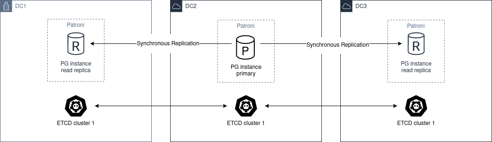
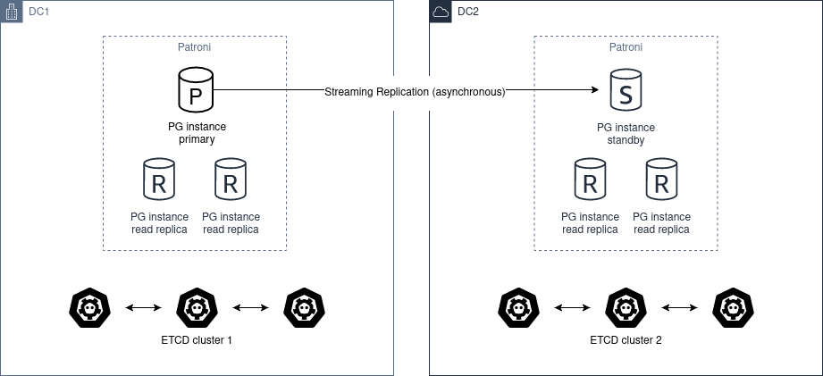

.. _ha_multi_dc:

=============
HA 多数据中心
=============

部署在多个数据中心的 PostgreSQL 集群的高可用性基于复制实现，复制既可以是同步的，也可以是异步的（参见 :ref:`replication modes <replication_modes>`）。

在这两种情况下，明确以下概念都很重要：

- Postgres 只有当它拥有 leading key 并能够更新 leading key 时，才能以 primary 或 standby leader 身份运行。
- 你应该运行奇数个 etcd、ZooKeeper 或 Consul 节点：3 个或 5 个！

同步复制
--------

要拥有一个能够自动容忍单个 zone 失效的多数据中心集群，至少需要 3 个节点。

架构图如下：

我们必须跨不同的数据中心部署一个 etcd、ZooKeeper 或 Consul 集群，最少需要 3 个节点，每个 zone 一个。

对于 Postgres，我们必须至少部署 2 个节点，且位于不同的数据中心。然后，你需要在全局 :ref:`dynamic configuration <dynamic_configuration>` 中设置 ``synchronous_mode: true``\。

这会启用同步复制，primary 节点将选择其中一个节点作为同步节点。

异步复制
--------

如果只有两个数据中心，更好的做法是拥有两个独立的 etcd 集群，并在第二个数据中心运行 Patroni :ref:`standby cluster <standby_cluster>`。如果第一个站点宕机，你可以手动提升 ``standby_cluster``\。

架构图如下：

自动提升是不可能的，因为 DC2 永远无法了解 DC1 的状态。

在这种场景下，你不应该使用 ``pg_ctl promote``\，而需要通过从 :ref:`dynamic configuration <dynamic_configuration>` 中移除 ``standby_cluster`` 部分来"手动提升"健康的集群。

.. warning::
    如果源集群仍在运行，而你却提升了 standby cluster，就会造成脑裂（split-brain）。

如果你希望恢复到"初始"状态，只有两种解决方法：

- 重新添加 standby_cluster 部分，这将触发 ``pg_rewind``\；不过，要让 ``pg_rewind`` 正常工作，集群必须使用 ``data page checksums``\（``initdb`` 的 ``--data-checksums`` 选项）初始化，并且/或者 ``wal_log_hints`` 必须设置为 ``on``\，但仍然存在 ``pg_rewind`` 因其他因素而失败的可能性。
- 从头重建 standby cluster。

在提升 standby cluster 之前，必须手动确保源集群已关闭（STONITH）。当 DC1 恢复后，集群必须转换回 standby cluster。

在此之前，你可以手动检查数据库，并提取从 DC1 与 DC2 之间的网络中断到你在 DC1 手动停止集群这段时间内发生的所有变更。

提取之后，你还可以手动将这些变更应用到 DC2 的集群中。

MySQL 备站
----------

双 DC 模式同样适用于 ``database.type: mysql``\：两端使用独立 DCS scope，并配置
``standby_cluster`` 指向远程主。MySQL 使用 **全量克隆 + GTID 级联**\（无
``restore_command`` / ``pg_rewind``\）。跨站割接请用
``patronictl promote-cluster`` / ``demote-cluster``\。完整清单（计划切换、
灾难提升、demote/重建）见 :ref:`mysql_ops`。
